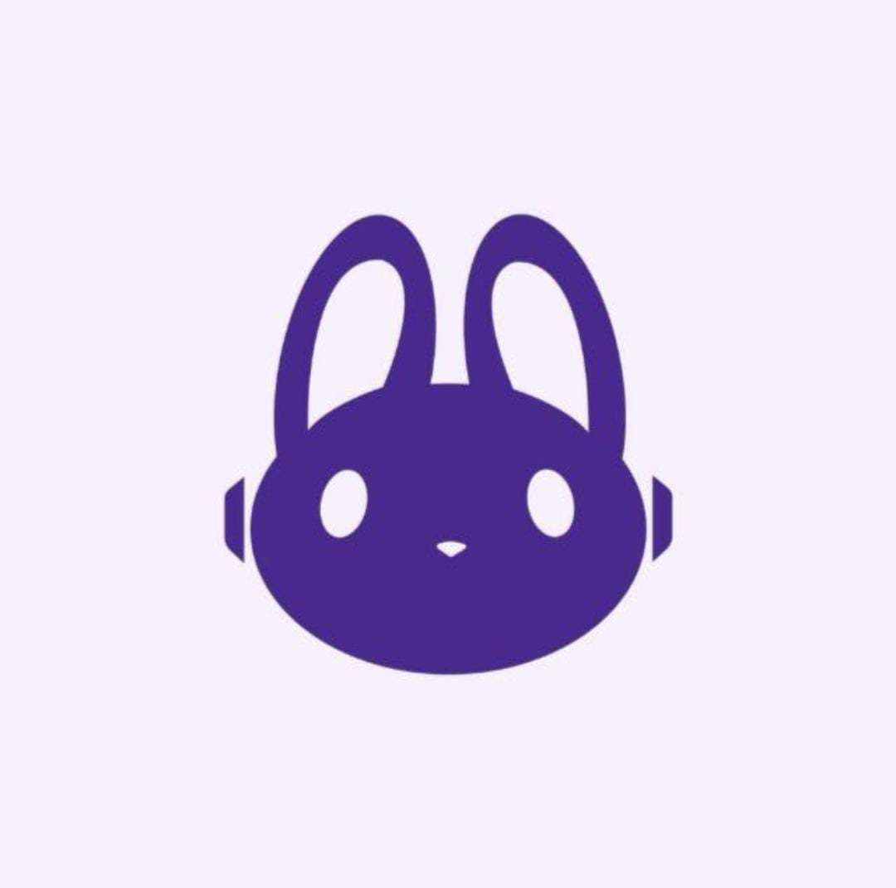

# 💜 Tech Girls — Hub Web de Portfólios & Comunidade

> Plataforma web moderna, responsiva e acessível desenvolvida pela comunidade **Tech Girls** para centralizar perfis, frentes de atuação e projetos práticos do grupo.



---

## 📌 Sobre o Projeto

O **Tech Girls Hub** funciona como a vitrine oficial da comunidade. Nosso objetivo é criar um espaço onde mulheres na tecnologia — desde estudantes buscando a primeira oportunidade até profissionais seniores — possam se conectar, compartilhar conhecimentos e expor seus projetos.

Este projeto foi desenvolvido durante o **Tech Girls Challenge** (Equipe Noite, Fullstack Web), focando em boas práticas de desenvolvimento front-end, acessibilidade (WCAG) e responsividade do mobile ao desktop.

---

## 🎨 Identidade Visual & Design Tokens (HUB-001)

O projeto adota um sistema centralizado de **Design Tokens** via variáveis CSS (`:root`), garantindo consistência visual, facilitando a manutenção e mantendo um alto contraste para acessibilidade:

- **Roxo Profundo (`#4B2189`)**: Cor primária da marca, utilizada em cabeçalhos, títulos e destaques.
- **Lilás Claro (`#F3EFF8`)**: Tom de fundo e contraste para textos em áreas escuras.
- **Branco (`#FFFFFF`)**: Fundo dos cartões para leitura confortável.
- **Tipografia**: Sistema de fontes nativo (`system-ui`) com escala modular para legibilidade.

---

## 🛠️ Tecnologias Utilizadas

- **HTML5 Semântico**: Estruturação acessível com uso de tags como `<header>`, `<main>`, `<section>`, `<article>` e `<footer>`.
- **CSS3 Moderno**: 
  - **Design Tokens** (Variáveis CSS).
  - **Flexbox & CSS Grid**: Layout flexível e grade responsiva para cartões de projetos.
  - **Posicionamento Absoluto & Camadas (`z-index`)**: Banners com cabeçalho flutuante integrado.
- **Git & GitHub**: Versionamento de código estruturado com o padrão *Conventional Commits*.

---

## 🚀 Funcionalidades & Evolução do Layout

Durante o desenvolvimento do projeto, realizamos melhorias contínuas na estrutura e no visual:

1. **Banners em Largura Total (`100vw`)**: Refatoração da estrutura HTML retirando os banners do container limitado, permitindo que a imagem ocupe toda a extensão da tela.
2. **Cabeçalho Integrado**: Posicionamento do `<header>` sobre o banner principal com efeito flutuante e cantos arredondados (`border-radius: 37px`).
3. **Legendas e Tipografia**: Ajuste de contraste, tamanho e posicionamento absoluto do `.overlay-hero` na base dos banners.
4. **Grid de Projetos Práticos**: Exibição das frentes de atuação da comunidade (Dev, Dados, Fullstack, QA, Governança e BI) em uma grade adaptável (`repeat(auto-fit, minmax(260px, 1fr))`).
5. **Acessibilidade**: Estruturação de headings (`h1` -> `h2` -> `h3`) e navegação por leitores de tela.

---

## 📁 Estrutura de Arquivos

```text
tech-girls-hub/
├── img-techgirls.jpg      # Imagem do banner principal e logo
├── projetoo.jpeg          # Imagem de fundo secundária
├── index.html             # Estrutura semântica da aplicação
├── style.css              # Estilos, variáveis CSS e regras de responsividade
└── README.md              # Documentação oficial do repositório

